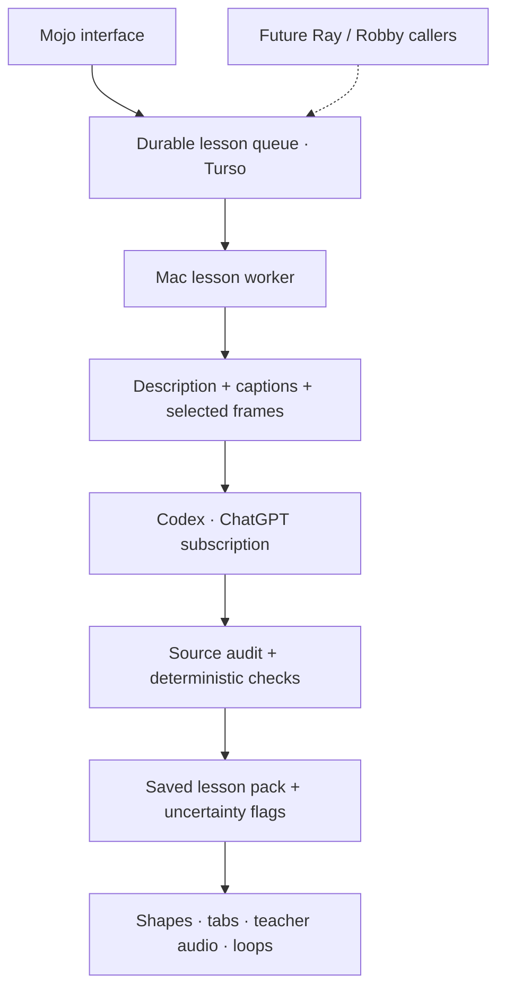

# Lesson engine

Open `/lessons`, paste a public YouTube guitar lesson (up to 60 minutes), or paste
a transcript. The web app queues the job in Turso. The lightweight Mac worker
fetches the description and English captions, inspects sampled video frames,
extracts each teaching section, and runs a second source-checking pass. It saves
a structured pack for visual practice, original teacher playback, speed control,
section/phrase looping, and a downloadable six-string text pack.

## Why this architecture



The browser can close while extraction continues. Vercel handles short requests;
the Mac handles downloads and model calls. Ray and Robby can become callers of the
same queue without becoming dependencies for practice. The model adapter is isolated
in `model_call`; a future audio-capable provider can keep the same pack contract.

Source checks establish where a claim came from, not that it is musically correct.
A second model pass can share the first pass's mistakes. Reliable audio verification
and measured phrase timing remain separate work; this version deliberately reports
that limit and offers the original teacher playback for checking.

## Run on your Mac

1. Install Python 3.11+, Node, ffmpeg, and Codex CLI (the ChatGPT desktop app's
   bundled CLI is preferred automatically).
2. Sign in with ChatGPT using `codex login`. Lesson extraction consumes that
   account's Codex allowance. It does not use an OpenAI or Gemini API key.
3. Set a random `LESSON_WORKER_TOKEN` on the Vercel project and the same token in
   `mac-server/.env`, alongside `LESSON_APP_URL=https://mr-mojo-rising.vercel.app`.
   The Mac uses a private queue endpoint; database secrets stay in Vercel.
   Alternatively, direct Turso access uses `TURSO_DATABASE_URL` and
   `TURSO_AUTH_TOKEN` in `.env.local` or `mac-server/.env`.
   Never commit secrets or copy Codex authentication files.
4. Run `bash mac-server/start-lessons.sh`. This creates an isolated lightweight
   Python environment. It does not start or modify the stem-separation worker.
5. Keep the worker running and the Mac online. Mojo shows connection status and
   refuses new imports when the worker is unavailable. Existing packs still work.

`npm run lessons:install` optionally installs a login service on macOS. It restarts
the worker after a crash and writes logs to `.mmr-logs/lessons.log`. It does not
change sleep settings. Stop it with
`launchctl bootout gui/$(id -u) ~/Library/LaunchAgents/com.mrmojorising.lessons.plist`.

The lesson tables initialize idempotently in both the worker and web routes.
`npm run db:migrate` includes the same schema. Optional `LESSON_CODEX_BIN` and
`LESSON_CODEX_MODEL` override the executable and model; otherwise the CLI default
model is used. Only ChatGPT sign-in is accepted by the queue worker.

For local development, both clients accept `TURSO_DATABASE_URL=file:/absolute/path/test.db`.
Run a standalone extraction without database credentials:

```sh
bash mac-server/start-lessons.sh --extract 'https://youtu.be/VIDEO_ID' --output /tmp/lesson.json
```

## Accuracy contract

- Captions and sampled frames are source evidence, not a guarantee of correctness.
  This version **does not analyze audio or measure note timing**. Playback is the
  original YouTube teacher, never synthesized or a guessed reconstruction.
- Every musical claim carries evidence and an optional review reason. Unmatched
  quotations, nonexistent frames, and audio claims are rejected. Details without
  matching evidence are withheld; uncertain retained details display `[VERIFY]`.
- Chord shapes have exactly six slots: high e, B, G, D, A, low E. `null` means
  unknown, `x` means explicitly muted. No standard chord dictionary is consulted.
- Tab slots preserve event order and simultaneous notes; spacing is not rhythm.
  Source performance times are distinct from teaching timestamps. Untimed pasted
  text never gets invented playback ranges. Fast or occluded passages may be incomplete.
- When exact phrase timing is unknown, playback offers a clearly labelled 24-second
  source cue around cited transcript/frame evidence, bounded by the chapter. This is
  a navigation aid, not a claimed musical performance interval; pack timing stays null.
- Free links require an exact description excerpt containing both the destination
  and an explicit free claim. Destinations are not crawled; advertised access may
  require signup. Paid links are excluded.
- The model receives source data as untrusted input. Its shell, web search and
  subagents are disabled, user configuration is not loaded, worker secrets are
  removed from its environment, and sessions are ephemeral.

The queue uses atomic claims and renewable leases. Stale workers cannot publish
over a new owner. Interrupted jobs recover once; manual retries are capped.
Validated sections are checkpointed in the ignored `mac-server/.lesson-cache/`,
keyed by source content, engine version and configured model. Retrying a failed
lesson reuses completed sections. Media files are temporary and deleted afterward.
The existing public single-user app remains unauthenticated, with at most three
pending lessons and twelve new lessons a day to bound workload.

## Verification

```sh
mac-server/venv-lessons/bin/python -m unittest discover -s mac-server -p test_lesson_engine.py
npx tsx --test src/lib/lesson-input.test.ts
npm run build
```

Benchmark: `https://youtu.be/WHujjJEnZpI` (GuitarZero2Hero's acoustic Layla lesson).
Check D5 versus spoken D-minor harmony, teacher-specific Bb5/C5 voicings, the open-A
variation, verse D/U caption corruption, and lesson time versus solo performance time.
No benchmark musical material is hardcoded into the engine.

The initial full run on 2026-10-04 took about 45 minutes and produced eight teaching
sections, 83 phrase entries (68 with note data), and 755 ordered note events, including
repeated/recap material. Spot checks preserved the partial D shape, Bb5/C5 voicings,
open-A variation, shifted-D5 ending, the visible DUDUDUDU pattern, and the muted-high-e
A variation. Only the advertised free ebook was retained; key and difficulty stayed
unknown. This is a coverage check, not a note-by-note accuracy score.

No exact phrase performance boundaries were established in that run, which led to
the separate source-cue playback mode. The published sample's review wording was
edited for clarity; note events and chord positions were unchanged. Full solo/audio
accuracy remains unverified. Long lessons should be treated as background jobs.
